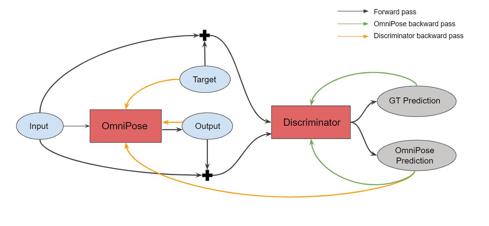
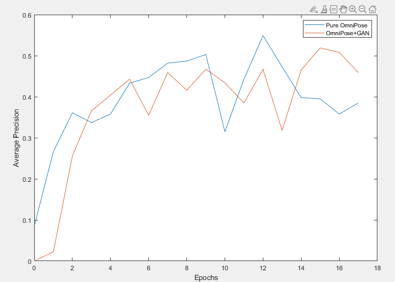
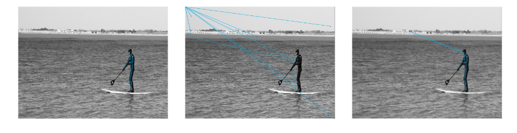
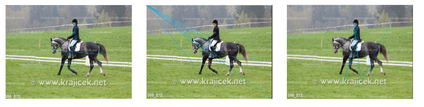

# AdversarialOmniPose

## OmniPose[1]

<figure>
    
    

        <figcaption>Figure 1: Omnipose Architecture[1]</figcaption>
    

</figure>

OmniPose is a multi-scale framework for multi-person pose estimation. Additionally to a modified HRNet backbone, they proposed the “Waterfall Atrous Spatial Pyramid” module or WASPv2.  
They say: "WASPv2 [...] is able to leverage both the larger Field-of-View of the Atrous Spatial Pyramid Pooling configuration and the reduced size of the cascade approach."

<figure>
    
    

        <figcaption>Figure 2: WASPv2 Module[1]</figcaption>
    

</figure>

## Contribution
Methods of human pose estimation using adversarial networks have yielded good results on relatively simple networks.[2] 
In our project, we implemented a similar adversarial network architecture to a more complex model, more specifically the existing OmniPose model to see the effect on the performance.
An advantage of this kind of adversarial method is that it can have a positive impact on the performance of a model without adding computational complexity in the inference process.
<figure>
    
    

        <figcaption>Figure 3: Implemented Adversarial Network</figcaption>
    

</figure>

## Datasets

The model is compatible without adaptation with the following public datasets: 
<ul>
<li> 

[COCO Dataset](https://cocodataset.org/)
</li>
<li>

[MPII Dataset](http://human-pose.mpi-inf.mpg.de/)</li>
</ul>
Our experiments have only been executed on the COCO dataset.

## Evaluation Metric
In the case of COCO, evaluation is based on  the Object Keypoint Similarity metric:
$$OKS = \frac{(\sum_i e^{-d_i^2/2s^2k_i^2})\delta(v_i>0)}{\sum_i\delta(v_i>0)}$$
Where $d_i$ is the euclidean distance between the predicted keypoint and it's ground truth, $v_i$ indicates if the keypoint is visible, s is the scale of the corresponding target and $k_i$ is the fallooff control constant. 
We consider OKS analogous to the intersection over the union, and therefore use it in the computation of precision and recall, by considering true positive if over a certain threshold and false positive if under it.
We then plot the precision/recall curve for a given keypoint, and for each recall point, find the highest precision point to the right.
<figure>
    
</figure>
We finally compute the area under the new curve for all predictions and call this value the average precision (AP) over a keypoint.
The final AP is the mean AP over all keypoints.

We report different $AP_k$ and $AR_k$ and for different positivity thresholds as well as medium and large size.

[more details here](https://kharshit.github.io/blog/2019/09/20/evaluation-metrics-for-object-detection-and-segmentation)

## Results

First, pure OmniPose (OmniPose) was retrained with 18 epochs to have a more reasonable comparison value since in the original paper, 210 epochs were used. The best performance achieve was an average precision of 0.549.

The OmniPose model was then used as the generator in the netword described above with the discriminator from the Adversarial Pose Net paper (OmniPoseAN). The model was trained from scratch for 18 epochs and achieved an average precision of 0.519. Though slightly lower, the training of the adversarial network was slightly more stable, epoch to epoch as compared to pure OmniPose. This comparison is shown in the graph below for the 18 epochs.

<figure>
    
    

        <figcaption>Figure 4: Comparsion of AP per Epoch</figcaption>
    

</figure>

Lastly, a pretrained OmniPose model was loaded into the adversarial network (OmniPoseAN2) and the training was continued for 10 more epochs resulting in an average precision value of 0.594.

Below, three of the same image is shown after being passed through an inference of the different experiments described above. The OmniPose model does the human pose estimation quite well. The OmniPoseAN model seems to perform very poorly although having a similar average precision. The OmniPoseAN2 performs well enough with one misplace keypoint, even though a higher average precision is reported.

<figure>
    
    

        <figcaption>Figure 4: Example 1</figcaption>
    

</figure>

Another example for all three models is shown below. 

<figure>
    
    

        <figcaption>Figure 5: Example 2</figcaption>
    

</figure>

## Pre-trained Models

## Data preparation:

### COCO
Download the dataset and extract it at {OMNIPOSE_ROOT}/data, as follows:

    ${OMNIPOSE_ROOT}
    |-- data
    `-- |-- coco
        `-- |-- annotations
            |   |-- person_keypoints_train2017.json
            |   `-- person_keypoints_val2017.json
            `-- images
                |-- train2017.zip
                `-- val2017.zip
                
### MPII
Download the dataset and extract it at {OMNIPOSE_ROOT}/data, as follows:

    ${OMNIPOSE_ROOT}
    |-- data
    `-- |-- mpii
        `-- |-- annot
            |   |-- train.json
            |   `-- valid.json
            `-- images

## Training

To train the pure OmniPose model, run the run_train.sh bash file with the selected configuration. In this project, the OmniPose/experiments/coco/omnipose_w48_384x288_train.yaml conifugration is used as a comparison. This bash file calls the train.py file for training.

To train the OmniPose with adversarial training, run the run_train_AN.sh bash file with the selected configuration. To compare to the pure OmniPose, the configuration file OmniPose/experiments/coco/omnipose_w48_384x288_train.yaml is used.  This bash file calls the train_AN.py file for training.

In the configuration files, ensure that the argument ROOT to the path where the data is stored. 

## Inferencing

To run an inference, run the bash file run_demo.sh with the selected configuration, OmniPose/experiments/coco/omnipose_w48_384x288_train.yaml is used. Ensure that the model you wish to infer has a correct path in the configuration file.

Pure OmniPose: /OmniPose/trained/coco/omnipose/omnipose_w48_384x288_train/checkpoint.pth

OmniPose with AN from scratch: /OmniPose/trained_GAN/coco/omnipose/omnipose_w48_384x288_train/checkpoint.pth

OmniPose with AN with pre-trained: /OmniPose/trained_GAN_2/coco/omnipose/omnipose_w48_384x288_train/checkpoint.pth

The inference will save images every 100 images in the folder OmniPose/samples. 

## References
### Papers
[1] Artacho, Bruno, and Andreas Savakis. "Omnipose: A multi-scale framework for multi-person pose estimation." arXiv preprint arXiv:2103.10180 (2021).

[2] Chen, Yu, et al. "Adversarial posenet: A structure-aware convolutional network for human pose estimation." Proceedings of the IEEE international conference on computer vision. 2017.

### Gits
[OmniPose](https://github.com/bmartacho/OmniPose)[1]

[Adversarial PoseNet](https://github.com/rohitrango/Adversarial-Pose-Estimation)[2]
